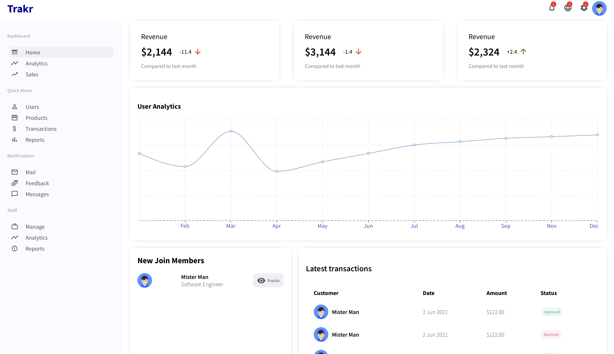

# Trakr Dashboard

Trakr is a simple dashboard for displaying some product and user information. This project was created to help me learn the [ReactJS](https://reactjs.org/) library. The project was made following the [React Admin Dashboard Tutorial](https://www.youtube.com/watch?v=aTPkos3LKi8&t=200s).

